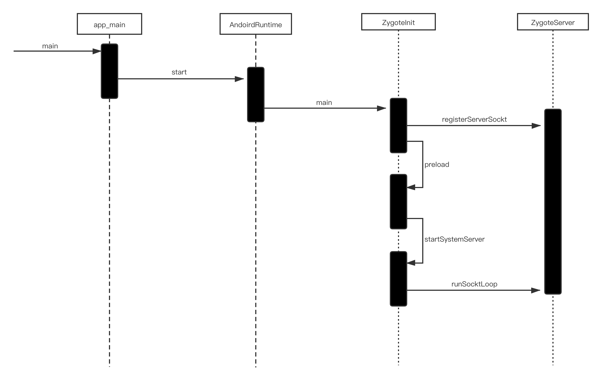
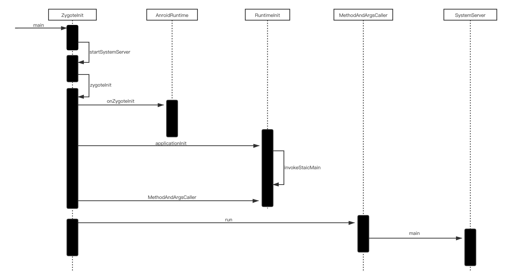
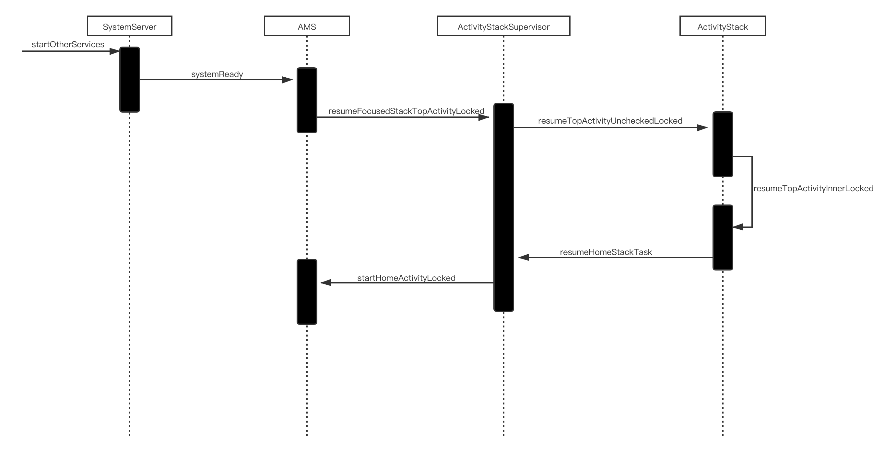
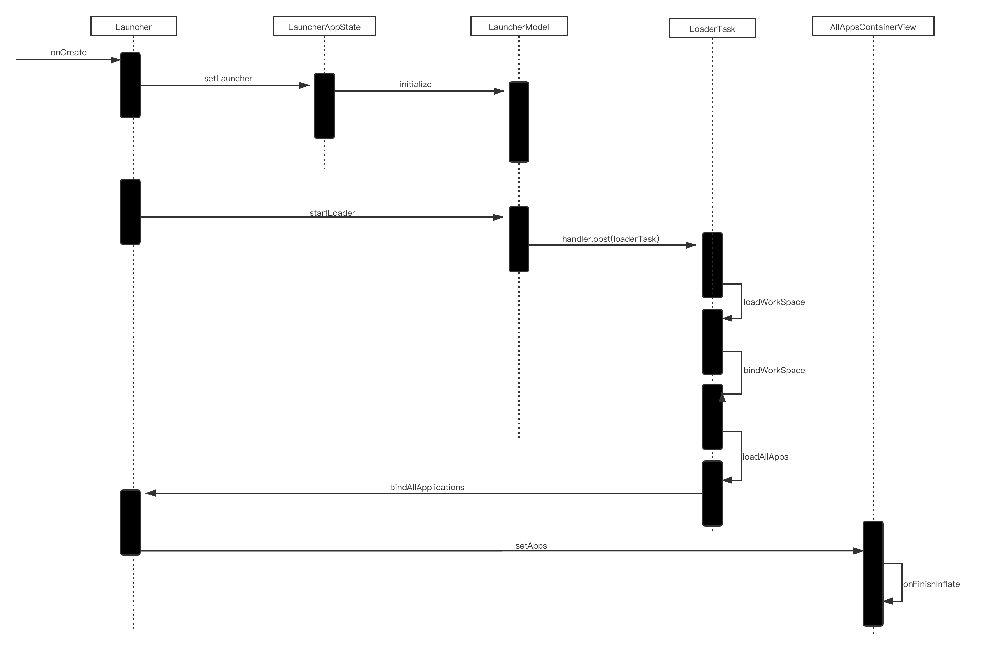

# **Android 系统启动**
##  init 进程
init 进程中处理了很多事情，主要处理了：
* **创建和挂载启动所需的文件目录**
* **初始化和启动属性服务**
* **解析 init.rc 配置文件并启动 Zygote 进程**
## Zygote 进程的启动过程

Zygote 进程启动过程：

* **创建 AppRuntime 并调用其 start 方法，启动 Zygote 进程**
* **创建 Java 虚拟机并为其注册 JNI 方法（注册 JNI 是为了从 native 层调用 Java 层）**
* **通过 JNI 调用 ZygoteInit 的 main 函数进入 Zygote 的 Java 框架层**
* **通过 registerServerSocket 方法创建服务器端的 Socket，并通过 runSelectLoop 方法等待 AMS 的请求来创建新的应用程序进程（Zygote 通过 fork 来创建子进程）**
* **启动 SystemServer 进程**
# SystemServer 进程

SystemServer 进程启动后主要做了以下工作：

* **启动 Binder 线程池（这样就可以使用 Binder 与其他进程进行通信了）**
* **创建 SystemServiceManger，其用于创建、启动以及管理系统的服务的生命周期**
* **启动各种系统服务**
# Launcher （系统桌面）的启动过程

SystemServer启动了 ActivityManagerService（AMS）后，AMS 会启动 Launcher。

## Launcher 图标的显示过程

# Android 系统启动总结
按下电源键 -> Bootloader（用于拉起 Android OS）-> Linux 内核启动 -> init 进程启动 -> Zygote 进程启动 -> SystemServer 进程启动 -> Launcher 启动

