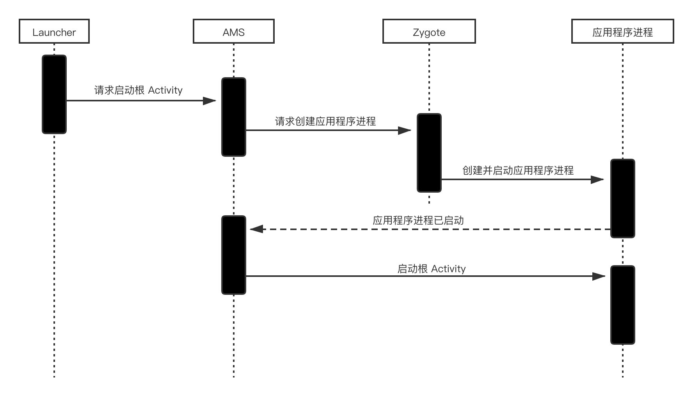
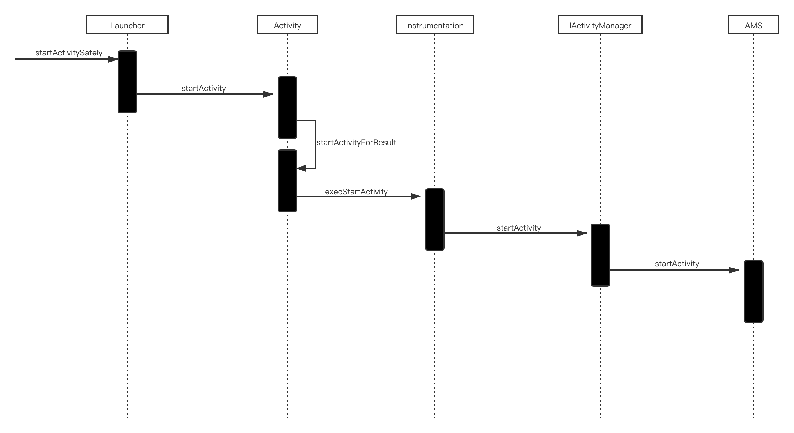
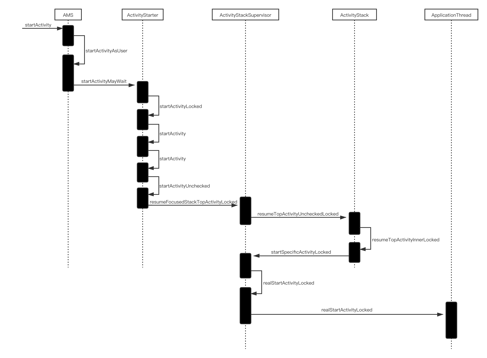
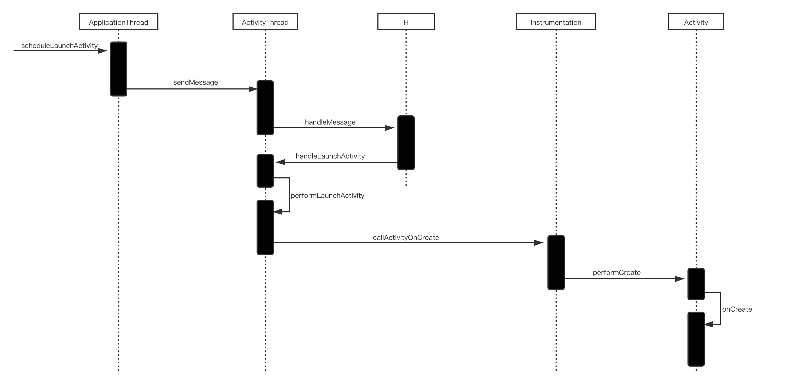

# **Activity 的启动过程**
Activity的启动过程分为两种：1、根 Activity 的启动过程，2、普通 Activity 的启动过程。
根 Activity 指的是应用程序启动的第一个 Activity，因此根 Activity 的启动过程一般也可视为应用程序的启动过程。
## 根 Activity 的启动过程
### 根 Activity 启动过程中涉及的进程
根 Activity 的启动过程涉及到 4 个进程：Launcher 进程、AMS 进程、Zygote 进程和应用程序进程。
当点击桌面应用图标后，Launcher 进程会向 AMS 发送启动应用程序请求（Binder 通信），AMS 进程首先会检查当前应用程序进程是否已经启动并运行，如果没有，则向 Zygote 进程发送启动应用程序进程的请求（Socket 通信），最后 AMS 会向 ApplicationThread 发送启动 Activity 的消息（Binder 通信）完成 Activity 的启动。

### Launcher 请求 AMS 过程

### AMS 到 ApplicationThread 的调用过程

### ActivityThread 启动 Activity 的过程

## 普通 Activity 的启动过程
普通 activity 的启动过程只会涉及 AMS 进程和应用程序进程。
