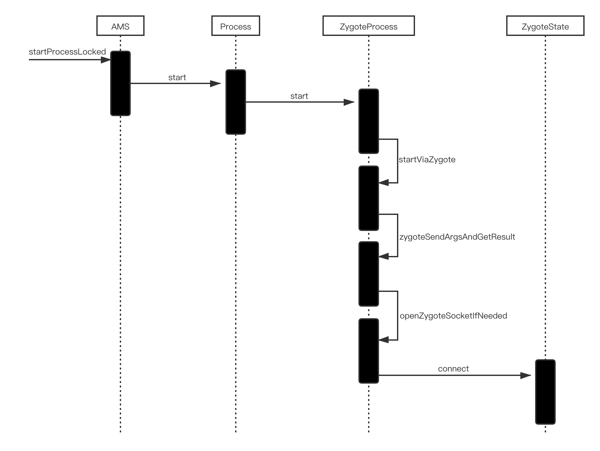
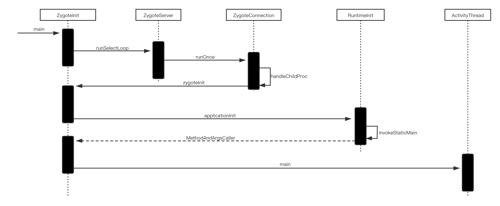
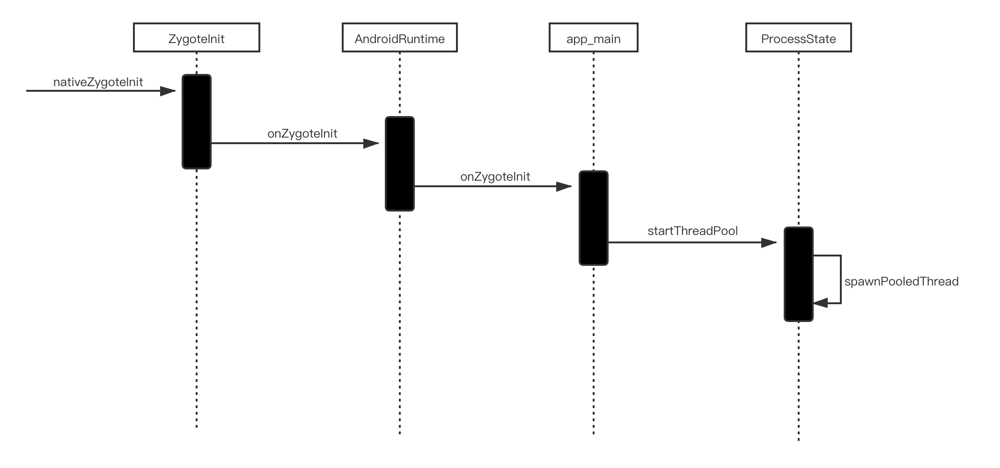

# **应用程序进程启动分析**
Android 应用程序进程的创建分为两步：1、AMS 发送启动应用程序进程的请求，2、Zygote 接受到请求并创建应用程序进程。
## AMS 发送启动应用程序进程的请求

## Zygote 创建应用程序进程

## Binder 线程池启动过程

Binder 线程池只会被启动一次。Binder 线程池启动后会调用 spawnPooledThread 方法创建一个 PoolThread 作为线程池中的第一个线程，也就是主线程。
在 ActivityThread 的 main 方法中会创建主线程 looper 并启动 looper 循环处理消息。