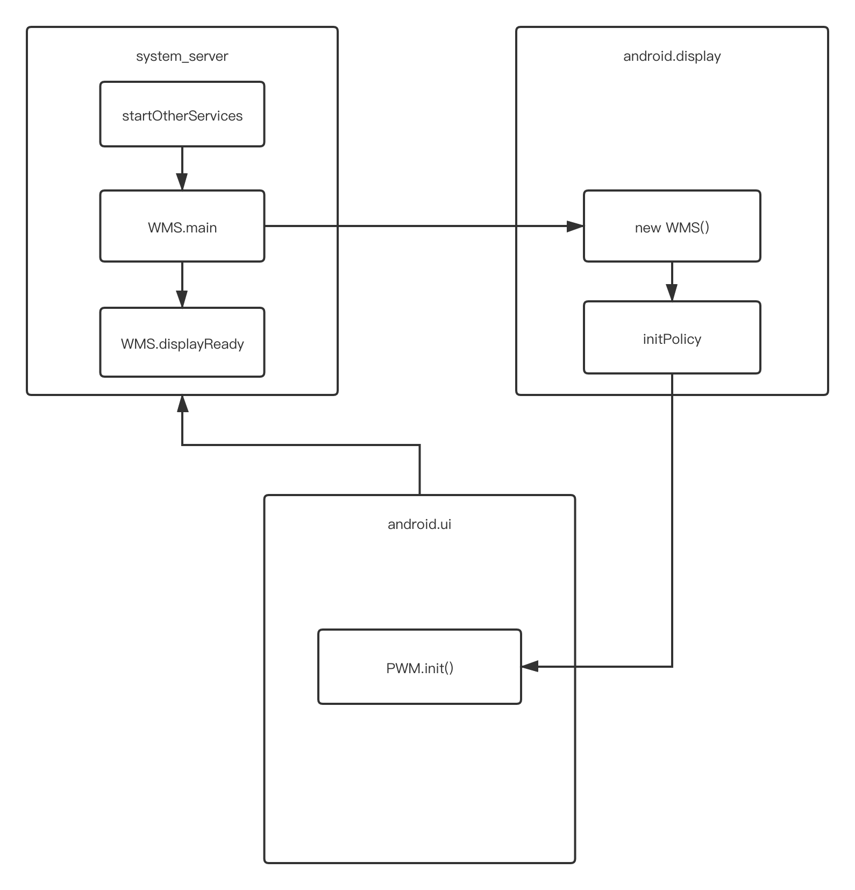

# **理解 WindowManagerService**
## WMS 的职责
* **窗口管理**
* **窗口动画**
* **输入系统的中转站**
* **Surface 管理**
## WMS 的创建过程
在 SystemServer 的 main 方法中会调用 run 方法，在 run 方法中，会创建 SystemServiceManager，它会对系统的服务进行创建、启动和生命周期管理。在 run 方法中还会分别启动引导服务(startBootstrapServices)、核心服务(startCoreServices)和其他服务(startOtherServices)，而 WMS 正是属于其他服务之一。
```
private void startOtherServices() {
    ...
    traceBeginAndSlog("InitWatchdog");
    final Watchdog watchdog = Watchdog.getInstance();
    watchdog.init(context, mActivityManagerService);
    traceEnd();

    traceBeginAndSlog("StartInputManagerService");
    inputManager = new InputManagerService(context);
    traceEnd();

    traceBeginAndSlog("StartWindowManagerService");
    // WMS needs sensor service ready
    ConcurrentUtils.waitForFutureNoInterrupt(mSensorServiceStart, START_SENSOR_SERVICE);
    mSensorServiceStart = null;
    wm = WindowManagerService.main(context, inputManager,
    mFactoryTestMode != FactoryTest.FACTORY_TEST_LOW_LEVEL,
    !mFirstBoot, mOnlyCore, new PhoneWindowManager());
    ServiceManager.addService(Context.WINDOW_SERVICE, wm);
     ServiceManager.addService(Context.INPUT_SERVICE, inputManager);
    traceEnd();

    ...

    traceBeginAndSlog("MakeDisplayReady");
    try {
        wm.displayReady();
    } catch (Throwable e) {
        reportWtf("making display ready", e);
    }
    traceEnd();

    ...

    traceBeginAndSlog("MakeWindowManagerServiceReady");
    try {
        wm.systemReady();
    } catch (Throwable e) {
        reportWtf("making Window Manager Service ready", e);
    }
    traceEnd();

    ...
}
```
在 startOtherServices 方法中会启动并初始化 Watchdog，它用来监控系统的一些关键服务的运行状况，Watchdog 每分钟会对被监控的服务进行检查，如果被监控的服务出现死锁，则会杀死 Watchdog 所在的进程，也就是 SystemServer 进程。然后会创建 IMS（InputManagerService），在执行 WMS 的 main 方法时，其内部会创建 WMS，并将 IMS 作为参数传入，这样 WMS 就持有了 IMS 的引用。最后会将 WMS 和 IMS 都注册到 ServiceManager 中。然后会初始化屏幕显示信息，并通知 WMS，系统的初始化工作已经完成(wm.systemReady())，其内部会调用 WindowManagerPolicy 的 systemReady 方法。
WMS 的 main 方法（运行在 system_server 中）：
```
public static WindowManagerService main(final Context context, final InputManagerService im,final boolean haveInputMethods, final boolean showBootMsgs, final boolean onlyCore,WindowManagerPolicy policy) {
    DisplayThread.getHandler().runWithScissors(() ->
        sInstance = new WindowManagerService(context, im, haveInputMethods, showBootMsgs,
            onlyCore, policy), 0);
    return sInstance;
}
```
DisplayThread 是一个单例的前台线程，用来处理需要低延迟显示的相关操作，并只能由 WindowManager、DisplayManager、InputManager 实时执行快速操作。在该方法中通过 DisplayThread 的 handler 创建了 WMS 实例。WMS 的创建运行在 android.display 线程中。
```
public final boolean runWithScissors(final Runnable r, long timeout) {
        if (r == null) {
           throw new IllegalArgumentException("runnable must not be null");
       }
       if (timeout < 0) {
           throw new IllegalArgumentException("timeout must be non-negative");
       }

       if (Looper.myLooper() == mLooper) {
           r.run();
           return true;
       }

       BlockingRunnable br = new BlockingRunnable(r);
       return br.postAndWait(this, timeout);
   }
```
在 runWithScissors 方法中首先对传入的 Runnable 和 timeout 进行了 null 判断，然后根据每个线程只有一个 Looper 的原理来判断当前线程（system_server）是否是 Handler 所指向的线程(android.display)，如果是则直接执行 Runnable 的 run 方法，否则调用 BlockingRunnable 的 postAndWait 方法，并将 Runnable 作为参数传递进入。BlockingRunnable 是 Handler 的内部类：
```
private static final class BlockingRunnable implements Runnable {
        private final Runnable mTask;
        private boolean mDone;

        public BlockingRunnable(Runnable task) {
            mTask = task;
        }

        @Override
        public void run() {
            try {
                mTask.run();
            } finally {
                synchronized (this) {
                    mDone = true;
                    notifyAll();
                }
            }
        }

        public boolean postAndWait(Handler handler, long timeout) {
            if (!handler.post(this)) {
                return false;
            }

            synchronized (this) {
                if (timeout > 0) {
                    final long expirationTime = SystemClock.uptimeMillis() + timeout;
                    while (!mDone) {
                        long delay = expirationTime - SystemClock.uptimeMillis();
                        if (delay <= 0) {
                            return false; // timeout
                        }
                        try {
                            wait(delay);
                        } catch (InterruptedException ex) {
                        }
                    }
                } else {
                    while (!mDone) {
                        try {
                            wait();
                        } catch (InterruptedException ex) {
                        }
                    }
                }
            }
            return true;
        }
    }
```
在 postAndWait 方法中将当前 BlockingRunnable 添加到 Handler 的任务队列中。前面创建 WMS 时传入的 timeou 参数为 0，因此如果 mDone 为 false 则会一直调用 wait 方法是的当前线程（system_server）进入等待状态。而在 BlockingRunnable 的 run 方法（android.display 线程）中执行了传入的 Runnable 的 run 方法，并调用 notifyAll 唤醒所有等待的线程。因此，system_server 线程需要等待 android.display 线程执行完毕才能继续执行后续任务，因为 android.display 线程中执行了 WMS 的创建工作，优先级更高。
```
private WindowManagerService(Context context, InputManagerService inputManager,
            boolean showBootMsgs, boolean onlyCore, WindowManagerPolicy policy,
            ActivityTaskManagerService atm, TransactionFactory transactionFactory) {
...
    mInputManager = inputManager; // Must be before createDisplayContentLocked.
...
    mDisplayManager = (DisplayManager)context.getSystemService(Context.DISPLAY_SERVICE);
    mDisplays = mDisplayManager.getDisplays();
    for (Display display : mDisplays) {
        createDisplayContentLocked(display);
    }
...    
    mActivityManager = ActivityManager.getService();
...
    mAnimator = new WindowAnimator(this);
    mAllowTheaterModeWakeFromLayout = context.getResources().getBoolean(
                 com.android.internal.R.bool.config_allowTheaterModeWakeFromWindowLayout);

    LocalServices.addService(WindowManagerInternal.class, new LocalService());
    initPolicy();

    // Add ourself to the Watchdog monitors.
    Watchdog.getInstance().addMonitor(this);
...
}
```
在 WMS 的构造方法中，会保存传入的 IMS 的引用。通过 DisplayManager 得到 display 数组并遍历调用 createDisplayContentLocked()方法将 Display 封装成 DisplayContent，DisplayContent 用来描述一块屏幕。然后获取 AMS 的引用。接着创建了 WindowAnimator，用于管理窗口动画。然后调用了 initPolicy 方法，初始化窗口管理策略 WindowManagerPolicy（WMP）。最后将自身添加到 Watchdog 中。
```
private void initPolicy() {
    UiThread.getHandler().runWithScissors(new Runnable() {
        @Override
        public void run() {
            WindowManagerPolicyThread.set(Thread.currentThread(), Looper.myLooper());
            mPolicy.init(mContext, WindowManagerService.this, WindowManagerService.this);
        }
    }, 0);
}
```
InitPolicy 方法与 WMS 的 main 方法类似，也是通过 Handler 执行了 WMP 的 init 方法。WMP 是一个接口，具体实现为 PhoneWindowManager，PhoneWindowManager 运行在 android.ui 线程中，它的优先级要高于 android.display 线程，因此 android.display 线程要等待 android.ui 线程执行完毕后才能继续执行后续任务。

## Window 的添加过程
WMS 的 addWindow 返回的是添加窗口的各种状态，比如添加成功，无效的 Display 等。这些状态被定义在 WindowManagerGlobal 中。在 addWindow 方法中首先会调用 WMP 的 checkAddPermission 方法来检测权限，具体实现是 PhoneWindowManager 的 checkAddPermission 方法。接着通过 displayId 获取窗口想要添加到哪个 DisplayContent 上，如果没有找到 DisplayContent 则会返回 WindowManagerGlobal.ADD_INVALID_DISPLAY。接着调用 windowForClientLocked 方法获取父窗口，如果父窗口为 null 或者 type 的取值范围（正确范围为 1000~1999）不正确则返回错误状态 WindowManagerGlobal.ADD_BAD_SUBWINDOW_TOKEN。检查通过后，则会通过 displayContent 的 getWindowToken 方法获取 WindowToken。如果有父窗口则将父窗口的 type 赋值给 rootType，如果没有父窗口则将当前窗口的 type 赋值给 rootType，如果 WIndowToken 为 null，则需要更加 rootType 来区分判断，如果 rootType 为 TYPE_INPUT_METHOD、TYPE_WALLPAPER 等值时，则会返回 ADD_BAD_APP_TOKEN。然后会隐式创建 WindowToken，说明当我们添加窗口时可以不向 WMS 提供 WindowToken。如果 WindowToken 不为空，也需要根据 rootType 的值进行判断，如果 rootType 的值为应用程序窗口时，则需要将 WindowToken 转换为 AppWindowToken，然后根据 AppWindowToken 继续。接着会创建 WindowState，它用来存储窗口的所有状态信息，然后后判断请求添加窗口的客户端是否已经死亡、窗口的 DisplayContent 是否为 null，如果是则不会继续后续逻辑处理，否则会调用 WMP 的 adjustWindowParamsLw 方法，该方法的具体实现在 PhoneWindowManager 中，会根据窗口的 type 对窗口的 LayoutParams 进行调整，然后调用 prepareAddWindowLw 方法，用于准备将窗口添加到系统中。最后将 WindowState 添加到 mWindowMap 中，将 WindowState 添加到对应的 WindowToken 中，这样 WindowToken 就包含了同一个组件的 WindowState。
* **对所要添加的窗口进行检查，如果不满足条件则终止添加窗口**
* **WindowToken 相关的处理，有些窗口类型需要提供 WindowToken，有些窗口则不需要，而是有 WMS 隐式创建 WindowToken**
* **WindowState 的创建和处理，将 WindowToken 和 WindowState 关联**
* **创建和配置 DisplayContent，完成窗口添加到系统的准备工作**
## Window 的删除过程
删除 Window 需要先调用WindowManagerImpl 的 removeView 方法，在该方法中会调用 WindowManagerGlobal 的 removeView 方法。在 WindowManagerGlobal 的 removeView 方法中会找到需要移除的 view 的索引，然后调用 removeViewLocked 方法，并将找到的索引作为参数传进去。在 removeViewLocked 方法中会根据索引找到对应的 ViewRootImpl，如果 ViewRootImpl 不为 null，则获取 IMS 实例并调用 windowDismissed 方法来结束输入相关的逻辑，接着调用 ViewRootImpl 的 die 方法，在此方法中会对 ViewRootImpl 当前状态进行判断，如果 ViewRootImpl 不在执行 performTraversals 方法则调用 doDie 方法，在 doDie 方法中首先会对线程进行检查，只有创建 ViewRootImpl 的原始线程才能操作 ViewRootImpl。接着会调用 dispatchDetachedFromWindow 方法来销毁 View，然后调用 WindowManagerGlobal 的 doRemoveView 方法，doRemoveView 方法会清除 ViewRootImpl 对应的元素，dispatchDetachedFromWindow 方法中滴啊用了 IWindowSession 的 remove 方法，实际调用了 WMS 的 removeWindow 方法，在 WMS 的 removeWindow 方法中会获取 Window 对应的 WindowState，并调用 WindowState 的 removeIfPossible，在该方法中会进行条件判断，如果满足其中一个条件就会 return，比如当前正在执行动画，并不会立即执行删除操作，如果没有满足条件则会调用 removeImmediately 方法，在此方法中会立即执行删除操作。
* **检查删除线程的合法性**
* **从 ViewRootImpl 列表、布局参数列表和 View 列表中删除与 ViewRootImpl 对应的元素**
* **判断是否可以直接执行删除操作**
* **执行删除操作，清理和释放与 ViewRootImpl 相关的一切资源**